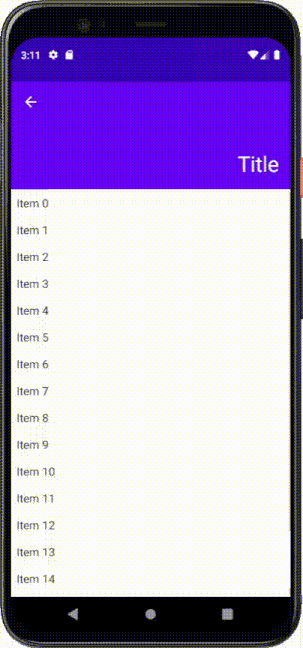

# compose-collapsing-toolbar
A simple implementation of [CollapsingToolbarLayout](https://developer.android.com/reference/com/google/android/material/appbar/CollapsingToolbarLayout) for Jetpack Compose

## Installation
You should add `mavenCentral()` repository before installation. Then add the following line to the `dependencies` block in your gradle:

```gradle
implementation "me.onebone:toolbar-compose:2.0.1"
```
OR
```kotlin
implementation("me.onebone:toolbar-compose:2.0.1")
```

## Example
An example can be found [here](app/src/main).

## Usage
### Connecting AppBarContainer and CollapsingToolbar
The first step you should do to use collapsing toolbar is to connect `AppBarContainer` and `CollapsingToolbar`. This can be accomplished by passing the same `CollapsingToolbarState` instance to `AppBarContainer` and `CollapsingToolbar`.
A most common way to get the state is by using `rememberCollapsingToolbarState()`:
```kotlin
val state = rememberCollapsingToolbarState()

AppBarContainer(
    collapsingToolbarState = state,
    /* ... */
) {
    CollapsingToolbar(
        // Be sure to pass the same CollapsingToolbarState instance you passed to AppBarContainer
        collapsingToolbarState = state,
        /* ... */
    ) {
        /* ... */
    }
}
```

### Adding child to CollapsingToolbar
Similar to [CollapsingToolbarLayout](https://developer.android.com/reference/com/google/android/material/appbar/CollapsingToolbarLayout), you may add children to the `CollapsingToolbar`. The toolbar will collapse until it **gets as small as the smallest child**, and will **get as large as the largest child**.

### Adding child to AppBarContainer
The AppBarContainer may consist of _at most one CollapsingToolbar_ and _unlimited number of body composable_. Each body composable should be marked with **appBarBody() modifier**:

```kotlin
AppBarContainer(/* ... */) {
    CollapsingToolbar(/* ... */) {
        /* ... */
    }

    LazyColumn(
        modifier = Modifier
            .appBarBody() // <<--- body composable should be marked with `appBarBody()` modifier 
    ) {
        /* ... */
    }
}
```

Note that the `CollapsingToolbar` only if the body composable is scrollable. You don't need to care about anything when using `LazyColumn` because it is scrollable by default, however, if you hope to use non-scrollable such as `Column` or `Row` as body you should use [verticalScroll()](https://developer.android.com/reference/kotlin/androidx/compose/foundation/package-summary#(androidx.compose.ui.Modifier).verticalScroll(androidx.compose.foundation.ScrollState,kotlin.Boolean,androidx.compose.foundation.gestures.FlingBehavior,kotlin.Boolean)) modifier for `CollapsingToolbar` to inspect nested scroll.
```kotlin
AppBarContainer(/* ... */) {
    CollapsingToolbar(/* ... */) {
        /* ... */
    }

    Column(
        modifier = Modifier
            .verticalScroll(rememberScrollState())
            // ^^ body composable should be scrollable for collapsing toolbar to play with nested scroll
            .appBarBody()
    ) {
        /* ... */
    }
}
```


## parallax, pin, road
You can tell children of CollapsingToolbar how to deal with a collapse/expansion. This works almost the same way to the `collapseMode` in the `CollapsingToolbarLayout` except for the `road` modifier.

```kotlin
CollapsingToolbar(/* ... */) {
    Image(
        modifier = Modifier.parallax(ratio = 0.2f) // parallax, pin, road are available
    )
}
```

### road modifier
The `road()` modifier allows you to place a child relatively to the toolbar. It receives two arguments: `whenCollapsed` and `whenExpanded`. As the name suggests, these describe how to place a child when the toolbar is collapsed or expanded, respectively.
This can be used to display a title text on the toolbar which is moving as the scroll is fed.
```kotlin
CollapsingToolbar(/* ... */) {
	Text(
        text = "Title",
        modifier = Modifier
            .road(
                whenCollapsed = Alignment.CenterStart,
                whenExpanded = Alignment.BottomEnd
            )
	)
}
```
The above code orders the title `Text` to be placed at the _CenterStart_ position when the toolbar is collapsed and _BottomEnd_ position when it is expanded. 


## Scroll Strategy
`ScrollStrategy` defines how CollapsingToolbar consumes scroll. You can set your desired behavior by providing `scrollStrategy` at `AppBarContainer`:

```kotlin
AppBarContainer(
    /* ... */
    scrollStrategy = ScrollStrategy.EnterAlways // EnterAlways, EnterAlwaysCollapsed, ExitUntilCollapsed are available
) {
    /* ... */
}
```


### ScrollStrategy.EnterAlways


### ScrollStrategy.EnterAlwaysCollapsed


### ScrollStrategy.ExitUntilCollapsed

